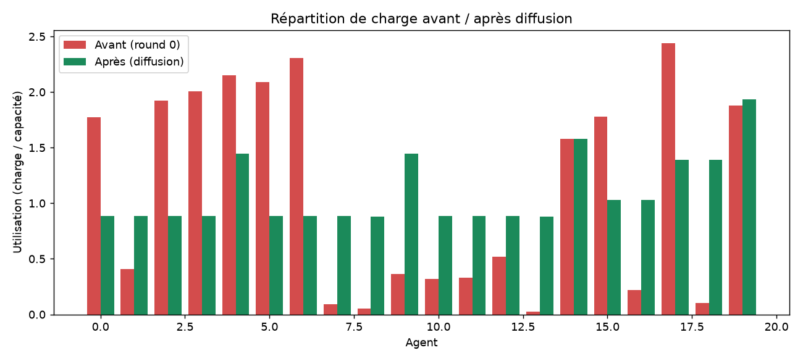
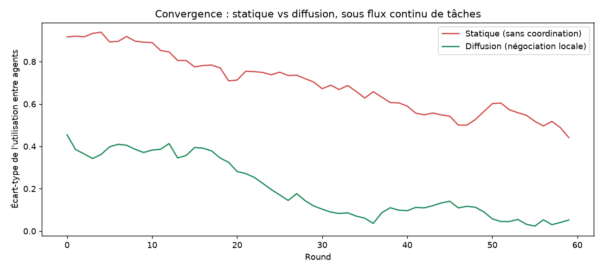
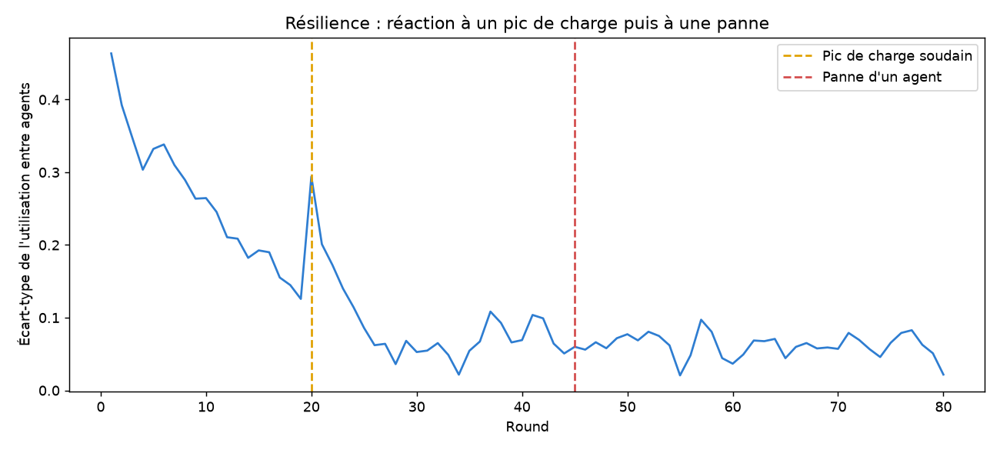

# AgentBalance — Répartition de charge décentralisée par négociation locale

Simulation d'un ensemble d'agents (noeuds de calcul) qui répartissent une
charge de travail entre eux **sans chef d'orchestre central** : chaque
agent négocie uniquement avec ses voisins directs, et le système converge
vers un équilibre global à partir de décisions purement locales.

Projet réalisé en lien avec les enseignements du **Master 1 Computer and
Network Systems** (spécialité systèmes autonomiques) : systèmes distribués,
algorithmique d'optimisation décentralisée, tolérance à la charge et aux
pannes.

## Pourquoi la diffusion load balancing (et pas les enchères)

Deux familles d'algorithmes étaient envisageables : la **diffusion**
(chaque agent compare sa charge à ses voisins directs et leur transfère
l'excédent) ou des **enchères locales** (chaque tâche est "vendue" au
voisin le moins chargé). La diffusion a été retenue pour ce prototype :

- elle est **prouvée mathématiquement convergente** vers l'équilibre sur
  un graphe connexe (Cybenko, 1989) — un critère de correction, pas
  seulement d'implémentation ;
- elle ne nécessite **aucun mécanisme de négociation/enchère** entre
  agents, ce qui réduit la surface de complexité pour une V1 tout en
  restant pleinement représentative d'un système autonomique décentralisé ;
- elle passe à l'échelle sans coordination supplémentaire : ajouter des
  agents n'augmente pas la complexité de la négociation (contrairement aux
  enchères, où chaque tâche doit être "mise en vente" auprès de plusieurs
  voisins).

Les enchères locales restent une extension naturelle si le projet est
approfondi (elles gèrent mieux l'hétérogénéité des tâches, la diffusion
suppose une charge divisible).

## Architecture

```
src/                → coeur de la simulation (partagé par tout le reste)
  agent.py            Agent (charge, capacité) + construction du réseau (grille torique)
  diffusion.py        algorithme de diffusion (négociation locale par round)
  simulator.py        scénarios : flux continu de tâches, perturbations (pic, panne)
  metrics.py          écart-type d'utilisation, utilisation max, charge totale
  visualize.py         génération des graphiques (matplotlib)
  main.py              exécute les 3 scénarios, sauvegarde les graphiques dans results/
backend/            → API FastAPI (conteneurisée), expose src/ en HTTP
  app/main.py
  Dockerfile
frontend/           → interface Vue 3 + Tailwind + Chart.js
  src/
    App.vue
    api.js
    components/       AgentGrid (heatmap), LineChart, ControlPanel
  Dockerfile
  nginx.conf
tests/              → tests automatisés (pytest) — simulation + API
docker-compose.yml  → orchestre backend + frontend
```

**Topologie** : grille 2D torique (~20 noeuds, 4 voisins chacun) — le cas
d'école classique pour étudier la diffusion, ni trop connectée (ce qui
masquerait les effets de propagation), ni trop clairsemée.

**Modélisation réaliste** : les agents ne font pas qu'accumuler de la
charge — ils la **traitent** à un débit proportionnel à leur capacité
(comme un serveur qui répond aux requêtes), ce qui crée un vrai régime
stationnaire plutôt qu'une croissance illimitée, et rend les mesures de
récupération après incident significatives.

## Résultats

### 1. Convergence pure depuis un état déséquilibré

À partir d'un état initial très déséquilibré (certains agents à 230%
d'utilisation, d'autres à 0%), la diffusion seule (sans nouvelle arrivée)
fait passer l'écart-type d'utilisation de **0,898 à 0,308 en 29 rounds**.



*(la convergence n'est pas totale : sur une topologie locale, l'information
met du temps à traverser tout le réseau — un résultat attendu et
révélateur de la nature du compromis décentralisé/global)*

### 2. Statique vs diffusion, sous flux continu de tâches

En simulant l'arrivée continue de nouvelles tâches sur des agents
aléatoires (comme des requêtes non coordonnées à l'entrée du système),
sur 60 rounds :

| | Écart-type moyen | Écart-type final |
|---|---|---|
| **Statique** (sans coordination) | 0,697 | 0,442 |
| **Diffusion** (négociation locale) | 0,200 | 0,052 |

**Réduction moyenne de l'écart-type grâce à la diffusion : 71,3 %.**



### 3. Résilience face à un pic de charge et à une panne d'agent

Scénario : régime stationnaire, puis un **pic soudain** (round 20, un
agent reçoit 3x sa capacité d'un coup) suivi d'une **panne d'agent**
(round 45, un noeud est retiré du réseau, sa charge redistribuée en
urgence à ses voisins) :

- Écart-type de référence (régime stationnaire) : **0,184**
- Pic au moment du choc de charge : **0,294**
- Récupération sous le seuil de référence : **1 round** après le pic,
  **1 round** après la panne



Le système absorbe la panne d'un agent presque sans à-coup visible — la
charge du noeud tombé est réabsorbée par ses voisins directs en un round,
sans intervention centrale.

## Lancer avec Docker (interface web complète)

```bash
docker compose up --build
```

- Frontend (interface complète, avec grille d'agents animée + graphiques
  + contrôles pour relancer la simulation avec d'autres paramètres) :
  http://localhost:8080
- Backend (API brute) : http://localhost:8000/api/health,
  http://localhost:8000/api/scenario/resilience

C'est la façon recommandée d'explorer le projet : contrairement au script
`main.py` (qui s'exécute une fois et s'arrête), le backend reste actif et
répond à la demande — tu peux changer le nombre d'agents, le round du pic
ou de la panne, et relancer directement depuis l'interface.

### Développer sans Docker

```bash
# Terminal 1 : backend
pip install -r backend/requirements.txt
PYTHONPATH=src uvicorn main:app --app-dir backend/app --reload --port 8000

# Terminal 2 : frontend (proxy /api vers localhost:8000, voir vite.config.js)
cd frontend
npm install
npm run dev
```

## Lancer le script (rapport statique, sans interface)

```bash
pip install -r requirements.txt
cd src
python3 main.py        # exécute les 3 scénarios, régénère results/*.png
```

## Tests

```bash
pip install -r requirements-dev.txt
pytest tests/ -v
```

Vérifie les propriétés attendues de l'algorithme : réduction (ou maintien)
de l'écart-type à chaque round, convergence en un nombre de rounds borné,
charge jamais négative, conservation de la charge totale (la diffusion
redistribue, elle ne crée ni ne détruit de charge), plus les endpoints de
l'API (backend).

> ⚠️ Comme pour le projet zemidjan-routing, je n'ai pas pu ouvrir
> l'interface dans un vrai navigateur ni lancer `docker compose up`
> moi-même (pas de navigateur, même headless, ni de démon Docker dans cet
> environnement). Ce qui a été vérifié sans ces outils : le build Vue
> (`npm run build`) passe sans erreur, l'API FastAPI répond correctement
> aux vraies requêtes (9 tests automatisés), et le proxy `/api` entre le
> frontend et le backend fonctionne (vérifié en local, hors Docker, avec
> `curl`). Le rendu visuel réel et le `docker compose up` de bout en bout
> sont à confirmer chez toi — n'hésite pas à me dire ce qui ne va pas.

## Paragraphe réutilisable (lettre de motivation)

> Pour approfondir ma compréhension des systèmes autonomiques, j'ai
> implémenté et évalué un algorithme de répartition de charge décentralisée
> (diffusion load balancing) entre agents négociant uniquement avec leurs
> voisins directs, sans coordination centrale. Les résultats obtenus
> montrent une réduction de 71 % du déséquilibre de charge par rapport à
> une architecture non coordonnée, ainsi qu'une capacité du système à
> absorber une panne de noeud en un round de négociation seulement — une
> illustration concrète des principes d'adaptabilité et de tolérance aux
> pannes au coeur du programme CNS.

## Prochaines étapes

- Version avec enchères locales (comparaison directe avec la diffusion)
- Vrais processus communicant via sockets/gRPC plutôt qu'une simulation en
  mémoire (rapprocherait le prototype d'un déploiement réel)
- Vérifier/peaufiner le rendu de l'interface dans un vrai navigateur (non
  testé visuellement, voir avertissement plus haut)
- CI GitHub Actions exécutant les tests à chaque push
